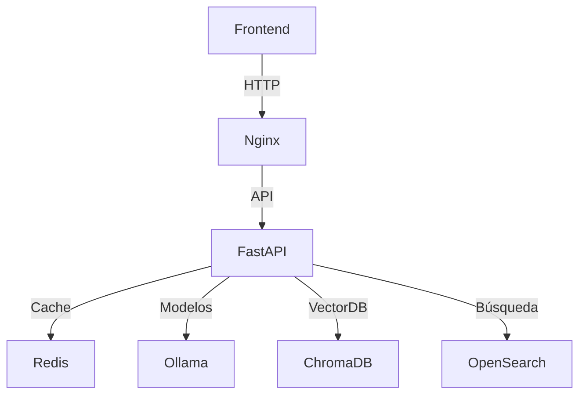

```markdown
# Chatbot Avanzado con Ollama, FastAPI y ChromaDB

 
 
 


## 🌐 Arquitectura del Sistema



## 🔍 Probar todos los servicios vía CURL

### 1. Ollama (Modelos de IA)
```bash
# Probar generación con TinyLlama
curl -X POST http://localhost:11434/api/generate \
  -H "Content-Type: application/json" \
  -d '{
    "model": "tinyllama",
    "prompt": "Explica el teorema de Pitágoras en español",
    "stream": false,
    "options": {"temperature": 0.3}
  }'
```

### 2. FastAPI + Gunicorn
```bash
# Health Check
curl "http://localhost:8000/health"

# Chat con historial (usando Redis)
curl -X POST "http://localhost:8000/api/chat" \
  -H "Content-Type: application/json" \
  -d '{
    "session_id": "abc123",
    "message": "Qué es Docker?"
  }'
```

### 3. ChromaDB (VectorDB)
```bash
# Buscar embeddings similares
curl -X POST "http://localhost:8001/api/similarity" \
  -H "Content-Type: application/json" \
  -d '{
    "embedding": [0.1, 0.2, 0.3],
    "top_k": 5
  }'
```

### 4. Redis (Cache)
```bash
# Verificar conexión
redis-cli -h localhost -p 6379 PING

# Ver datos de sesión
redis-cli --raw GET "session:abc123"
```

### 5. OpenSearch
```bash
# Buscar documentos
curl -X GET "http://localhost:9200/my_index/_search?q=tecnología&pretty"
```

### 6. Nginx
```bash
# Verificar configuración
curl -I "http://localhost" -H "Host: localhost"

# Probar balanceo de carga (si aplica)
for i in {1..5}; do curl -s "http://localhost/api/health"; done
```

## 🛠️ Stack Tecnológico Completo

| Servicio       | Versión | Puerto  | Uso Principal                |
|----------------|---------|---------|------------------------------|
| Ollama         | latest  | 11434   | Modelos de lenguaje          |
| FastAPI        | 0.95+   | 8000    | API REST                     |
| Gunicorn       | 20.1+   | 8000    | WSGI Server                  |
| ChromaDB       | 0.4+    | 8001    | Vector Database              |
| Redis          | 7.0+    | 6379    | Cache y sesiones             |
| OpenSearch     | 2.10+   | 9200    | Búsqueda full-text           |
| Nginx          | 1.25+   | 80/443  | Reverse Proxy                |

## 🐳 Despliegue con Docker Compose

```bash
# Iniciar todos los servicios
docker-compose up -d --build

# Escalar workers de Gunicorn
docker-compose scale fastapi-worker=4

# Monitorizar servicios
docker-compose logs -f ollama fastapi nginx
```

## 🔧 Variables de Entorno Clave

```ini
# .env
OLLAMA_MODEL=tinyllama
REDIS_URL=redis://redis:6379/0
OPENSEARCH_HOSTS=opensearch:9200
GUNICORN_WORKERS=4
NGINX_WORKER_PROCESSES=2
```

## 📌 Características Clave

1. **Interfaz Matrix-style**
   - Diseño neón verde/negro
   - Efectos de terminal interactiva
   - Soporte para streaming de respuestas

2. **Backend Optimizado**
   - Cache Redis para sesiones
   - Balanceo de carga con Nginx
   - Workers Gunicorn configurables

3. **Búsqueda Híbrida**
   - ChromaDB para embeddings
   - OpenSearch para full-text search
   - Cache multi-nivel

4. **Modelos de IA**
   - Soporte para múltiples modelos via Ollama
   - Preprocesamiento en español
   - Historial de conversación contextual

## 🚨 Solución de Problemas

```bash
# Verificar salud de OpenSearch
curl "http://localhost:9200/_cat/health?v"

# Estadísticas de Redis
redis-cli INFO

# Probar conexión a ChromaDB
curl "http://chromadb:8001/api/v1/heartbeat"
```

## 📄 Licencia

MIT License - Ver [LICENSE](LICENSE) para más detalles.
```

### Mejoras incluidas:

1. **Diagrama de arquitectura** con Mermaid
2. **Sección organizada por servicios** con ejemplos prácticos de CURL
3. **Tabla comparativa** del stack tecnológico
4. **Variables de entorno clave** documentadas
5. **Comandos de solución de problemas** por servicio
6. **Detalles específicos** para cada componente:
   - Versiones mínimas
   - Puertos expuestos
   - Uso principal

